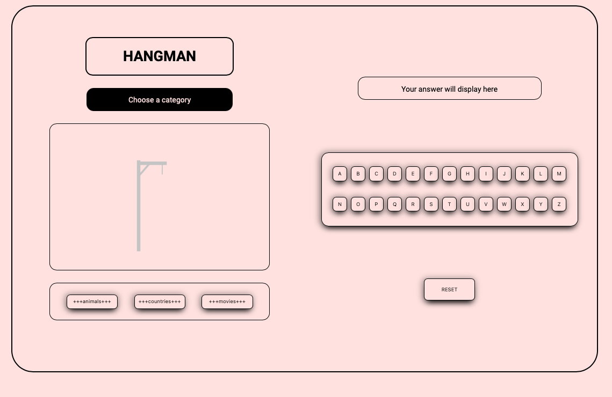
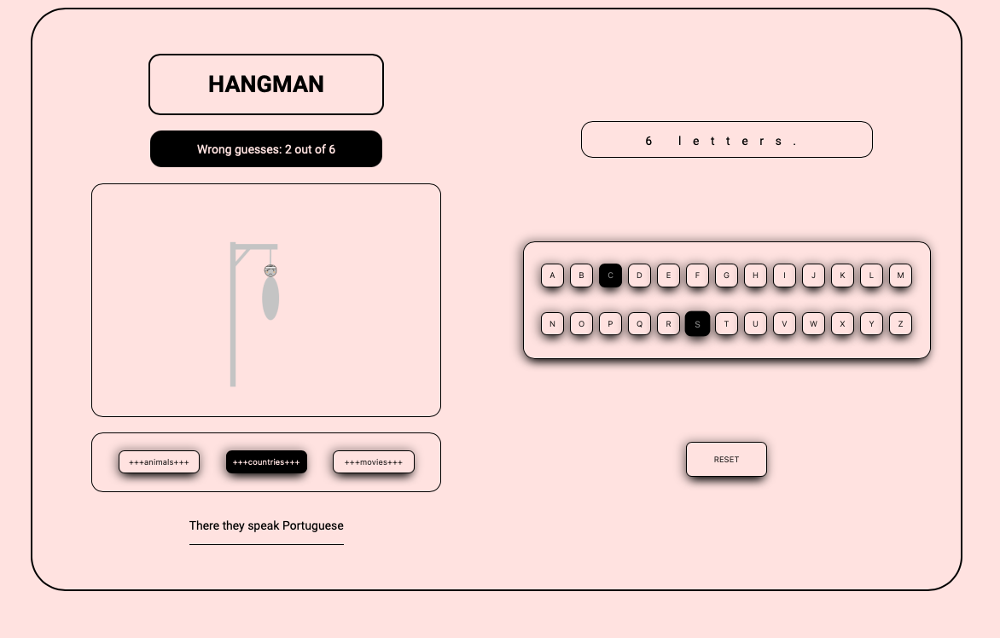
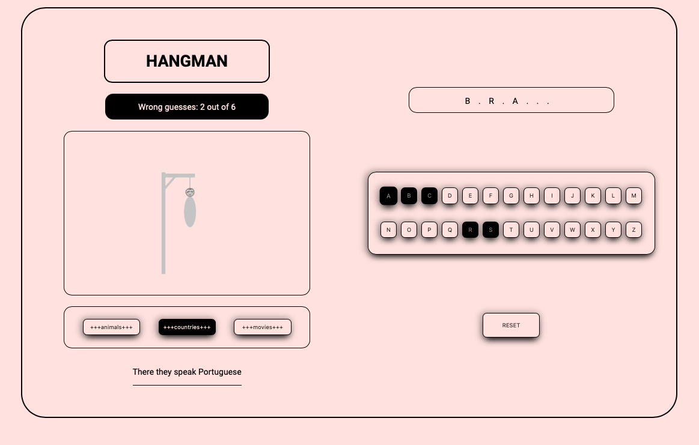
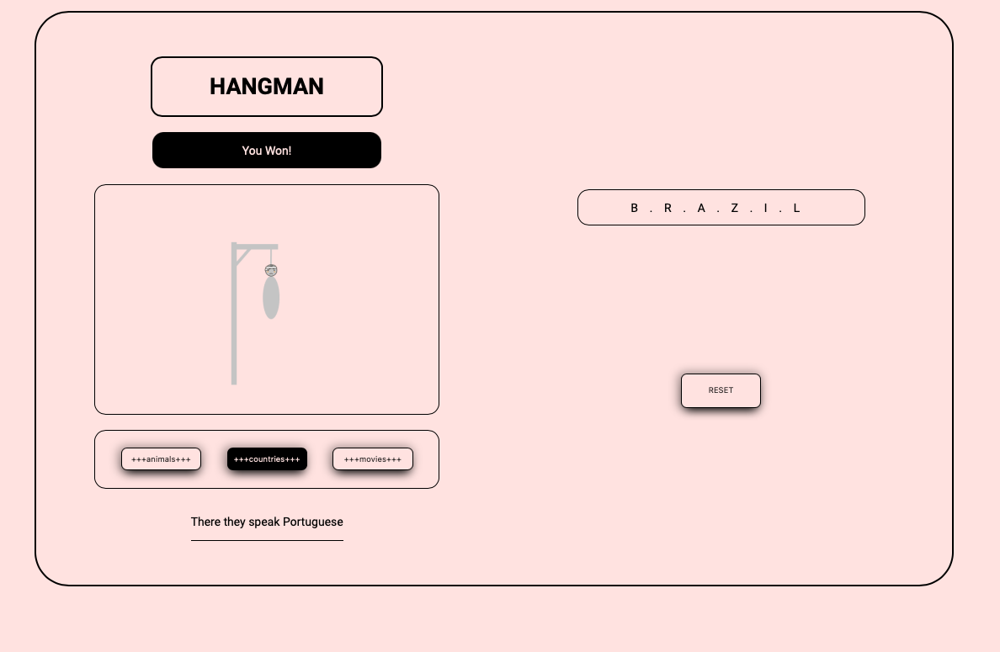
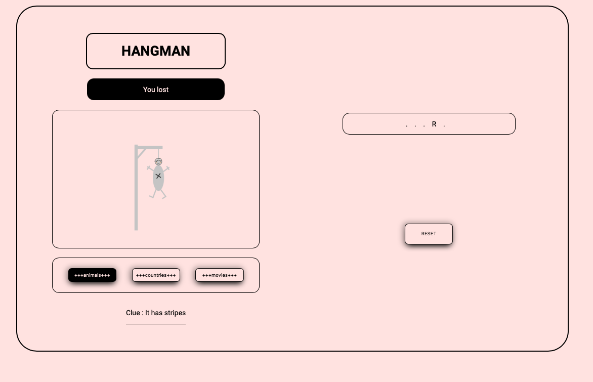

---

## PHASE ONE : Content ;

1. Name of the game.
2. Project Wireframe.
3. Overall browser-based game pseudocode.

---

---

### 1. Name Of The Game :

Hangman.

---

### 2. Project Wireframe :

click [here](https://app.moqups.com/2uMfow5Uk0/view/page/ad64222d5) to view my wireframe.

---

### 3. Overall browser-based game pseudocode.

---

#### **Declaring Variables.**

- var animals = Array of strings of name of animals.
- var answer = Secret word.
- var clue = Text inside the clue container.
- var answerDisplay = Text area that will display the secret word.
- var keys = Buttons inside the keyboard container with the values of the alphabet.
- var loosingImg = Image that will display as the user guesses incorrect letters.
- var guessesDisplay = Text that will display the wrong guesses the user has during the game.
- var keyboardContainer = Contains the buttons of the keyboard.
- var chances = Set at 0.
- var maxChances = Set at 6 (num of max wrong guesses the user is allowed to have.)
- var correctAnswer = Set to an empty array.
- var splitAnswer =
- var index =
- var blankAnswer = Set to an empty array.
- var resetBtn = Button that will reset the game.
- var test = ???.

#### **Functions.**

    FUNCTION inizializer.

    Sets the answer var to a secret word randomly from the animals var.
    Sets the Sets the text in the answer container to the length of the answer varibale.
    Split answer var is set to an array of from answer var.
    Sets the styling ID for the way the answer will be displayed to the user.
    Checks for the answer var value and sets the condition to display a clue based on the content of the answer var.

    END OF FUNCTION.

    FUNCTION reset game.

    Calls the initializer function.
    Text inside guesses display container is set back to original state.
    Loosing game container is set back with original image.
    Remove ID so keyboadr container is displayed again.
    Var chances is set back to 0.
    Remove styling from the clicked buttons inside the keyboard container to make them look clickable again.
    Set value of var correct answer back to an empty array.

    END OF FUNCTION.

---

#### **Event LIsteners.**

    FOR LOOP over keys var containing all the buttons in the keyboard container.
        Add a click event listener to each button.
        Style the clicked buttons to make them
        look not  clickable.

        IF the value in the button clicked is present
        in the var answer value
            THEN
                The index variable is set to the
                index number of the clicked button
                value in  the split array.

                The var blank answer is set to the
                value of the button clicked
                at the index of var index value.

                Turn the answer display inner text into
                a string.

                    IF the var correct answer includes
                    the value of the button clicked,
                    it is stored in a varibale
                    for comparison porpuses.

                    ELSE it is stored in the
                    correct answer var.

                    END OF IF.

                IF the length of correct asnwer var
                is the same of answer var.

                    THEN guesses display is updated to
                    inform the user they have won.

                    Hide keyboard container to prevent
                    user from keep playing.

        IF the value of the button clicked is not
        present in the answer var.

            THEN var chances adds  1.
            Image that shows the progress of the
            incorrect guesses is updated.

            When chances is equal to the value of
            max chances:

            Display the last image to the user.
            Text in guesses display container informs
            user they have lost.
            Set ID attribute to keyboard container
            to prevent user from keep playing.

            END OF IF.

        END OF LISTENER EVENT.

    END OF FOR LOOP.

    ---

    Add event click event istener to reset button var.
        calls reset game function.

        END OF FUNCTION.

    END OF LISTENER EVENT.

---

---

## PHASE TWO : Content ;

1. Title Of The Game & Quick Intro.
2. Game Screenshots.
3. Technologies Used.
4. Getting Started.
5. Next Steps

---

---

### 1. Title Of The Game :

Hangman.

---

### 1. Quik Intro :

Hangman is a popular word guessing game where the player attempts to build a missing word by guessing one letter at a time. After a certain number of incorrect guesses, the game ends and the player loses. The game also ends if the player correctly identifies all the letters of the missing word.

---

### 2. Game Screenshots :

1. Main page.

2. After a few wrong guesses.

3. After a few wrong & correct guesses.

4. After a user has won.

5. After a user has lost.

6. After reseting page.

---

### 3. Technologies Used :

1. HTML
2. CSS
3. JavaScript
4. git
5. gitHub
6. Netlify

---

### 4. Getting Started :

1. Instructions:

Take a look at the category and the the clue located to the bottom left part of the screen before clicking on the keyboard buttons.

Click on the button with the letter you think might be contained in the secret answer.

you have 6 opportunities to guess an incorrect letter.

If you reach 6 incorrect gueeses and you haven't guess the secret word, you loose.

If you manage to guess the secret word before your six chances are gone, you win.

Either way click on the reset button to start over.

2. Link to play the game :

Click [here](https://optimistic-northcutt-494969.netlify.app) to play the game.

---

### 5. Next Steps :

Futher imrpovements to the brower-based game:

1. Make it responsive
2. Improve CSS styles
3. Add AI so the user can play against the computer
4. Add more categories
5. Have more words per category.
